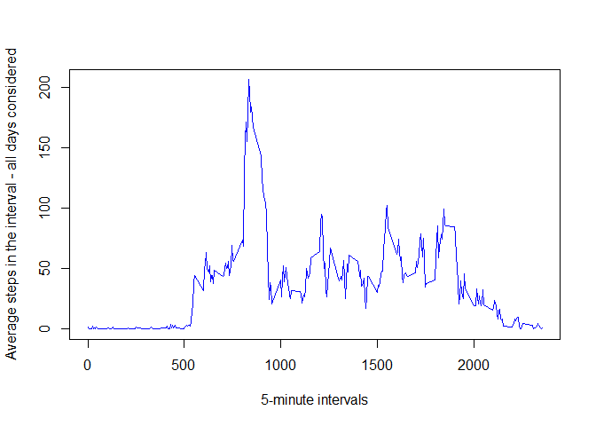
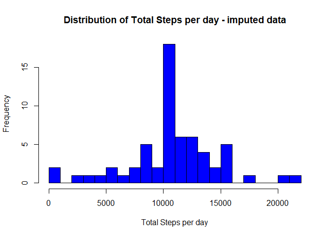

## Setting Global Options


```r
knitr::opts_chunk$set(echo = TRUE, results = "asis", warning = TRUE, message = TRUE)
```

## Loading R packages

```r
library(xtable)
library(ggplot2)
library(lattice)
```

## Loading and preprocessing the data

### 1. Load the data (i.e. read.csv())

##### Unzip the file


```r
zipDataFile <- "activity.zip"
dataFile <- "activity.csv"
if(!file.exists(dataFile)){
    unzip(zipDataFile)
}
```
##### Read and load the data


```r
workingDirectory <- getwd()
initial <- read.table(file.path(workingDirectory, 
        dataFile),
		header = TRUE,
		sep = ",",
		nrow = 1000)

classes <- sapply(initial, class)

fullData <- read.table(file.path(workingDirectory,
	        dataFile), 
	        header = TRUE,
	        sep = ",",
	        na.strings="NA",
	        colClasses	= classes,
	        comment.char = "#",
	        stringsAsFactors=FALSE)

rm(initial)	
```

##### A first look at the data ..

<!-- html table generated in R 3.5.0 by xtable 1.8-3 package -->
<!-- Mon Dec 31 17:05:32 2018 -->
<table border=1>
<tr> <th>  </th> <th> steps </th> <th> date </th> <th> interval </th>  </tr>
  <tr> <td align="right"> 1 </td> <td align="right">  </td> <td> 2012-10-01 </td> <td align="right">   0 </td> </tr>
  <tr> <td align="right"> 2 </td> <td align="right">  </td> <td> 2012-10-01 </td> <td align="right">   5 </td> </tr>
  <tr> <td align="right"> 3 </td> <td align="right">  </td> <td> 2012-10-01 </td> <td align="right">  10 </td> </tr>
  <tr> <td align="right"> 4 </td> <td align="right">  </td> <td> 2012-10-01 </td> <td align="right">  15 </td> </tr>
  <tr> <td align="right"> 5 </td> <td align="right">  </td> <td> 2012-10-01 </td> <td align="right">  20 </td> </tr>
  <tr> <td align="right"> 6 </td> <td align="right">  </td> <td> 2012-10-01 </td> <td align="right">  25 </td> </tr>
  <tr> <td align="right"> 7 </td> <td align="right">  </td> <td> 2012-10-01 </td> <td align="right">  30 </td> </tr>
  <tr> <td align="right"> 8 </td> <td align="right">  </td> <td> 2012-10-01 </td> <td align="right">  35 </td> </tr>
  <tr> <td align="right"> 9 </td> <td align="right">  </td> <td> 2012-10-01 </td> <td align="right">  40 </td> </tr>
  <tr> <td align="right"> 10 </td> <td align="right">  </td> <td> 2012-10-01 </td> <td align="right">  45 </td> </tr>
   </table>

### 2. Process/transform the data (if necessary) into a format suitable for your analysis

##### Change the date variable from factor to date format. Delete rows with missing values saving the data in a new dataframe. NB: the original dataframe is kept for further use later

```r
fullData$date <- as.Date(fullData$date)
cleanData <- subset(fullData, !is.na(fullData$steps))
```

## What is mean total number of steps taken per day?

### 1. Make a histogram of the total number of steps taken each day

```r
totalStepsByDay <- tapply(cleanData$steps, cleanData$date, sum)
hist(totalStepsByDay,
     col="blue",
     breaks=20,
     xlab="Total Steps per day",
     ylab="Frequency",
     main="Distribution of Total Steps per day - no missing data")
```

<!-- -->


### 2. Calculate and report the mean and median total number of steps taken per day

```r
mean(totalStepsByDay)
```

[1] 10766.19

```r
median(totalStepsByDay)
```

[1] 10765


## What is the average daily activity pattern?

### 1. Make a time series plot (i.e. type = "l") of the 5-minute interval (x-axis) and the average number of steps taken, averaged across all days (y-axis)

```r
intervalAverage <- tapply(cleanData$steps, cleanData$interval, mean)
intervalAverageDF <- data.frame(interval=as.integer(names(intervalAverage)), averageSteps=intervalAverage)

with(intervalAverageDF,
     plot(interval,
          averageSteps,
          type="l",
          col = "blue",
          xlab="5-minute intervals",
          ylab="Average steps in the interval - all days considered"))
```

<!-- -->

### 2. Which 5-minute interval, on average across all the days in the dataset, contains the maximum number of steps?

```r
maxAverageSteps <- max(intervalAverageDF$averageSteps)
intervalAverageDF[intervalAverageDF$averageSteps == maxAverageSteps, ]
```

    interval averageSteps
835      835     206.1698

## Imputing missing values

### 1. Calculate and report the total number of missing values in the dataset (i.e. the total number of rows with NAs)

```r
sum(is.na(fullData))
```

[1] 2304

### 2. Devise a strategy for filling in all of the missing values in the dataset. The strategy does not need to be sophisticated. For example, you could use the mean/median for that day, or the mean for that 5-minute interval, etc.

##### Using average data to correct missing information

### 3. Create a new dataset that is equal to the original dataset but with the missing data filled in.

```r
imputeData <- fullData
naLogicalVector <- is.na(fullData$steps)
imputeData$steps[naLogicalVector] <- intervalAverage[as.character(imputeData$interval[naLogicalVector])]
```

### 4. Make a histogram of the total number of steps taken each day and Calculate and report the mean and median total number of steps taken per day. Do these values differ from the estimates from the first part of the assignment? What is the impact of imputing missing data on the estimates of the total daily number of steps? 

##### Histogram with imputed data


```r
newTotalStepsByDay <- tapply(imputeData$steps, imputeData$date, sum)
hist(newTotalStepsByDay,
     col="blue",
     breaks=20,
     xlab="Total Steps per day",
     ylab="Frequency",
     main="Distribution of Total Steps per day - imputed data")
```

<!-- -->

##### Mean and Median with imputed data


```r
mean(newTotalStepsByDay)
```

[1] 10766.19

```r
median(newTotalStepsByDay)
```

[1] 10766.19

##### If we compare the imputed data with the cleaned data used before, the differences are negligible (n.b.: only on median value). A possible explanation is the use of media values for missing values.

## Are there differences in activity patterns between weekdays and weekends?

### 1. Create a new factor variable in the dataset with two levels - "weekday" and "weekend" indicating whether a given date is a weekday or weekend day.


```r
imputeData$dateType <- ifelse(weekdays(imputeData$date) %in% c("sabato", "domenica"), "weekend", "weekday")
imputeData$dateType <- as.factor(imputeData$dateType)
```

### 2. Make a panel plot containing a time series plot (i.e. type = "l") of the 5-minute interval (x-axis) and the average number of steps taken, averaged across all weekday days or weekend days (y-axis). The plot should look something like the following, which was creating using simulated data.


```r
averagedImputeData <- aggregate(steps ~ interval + dateType, data=imputeData, mean)
xyplot(steps ~ interval | factor(dateType),
         layout = c(1, 2),
         xlab="Interval",
         ylab="Number of steps",
         type="l",
         lty=1,
         data=averagedImputeData)
```

<!-- -->


